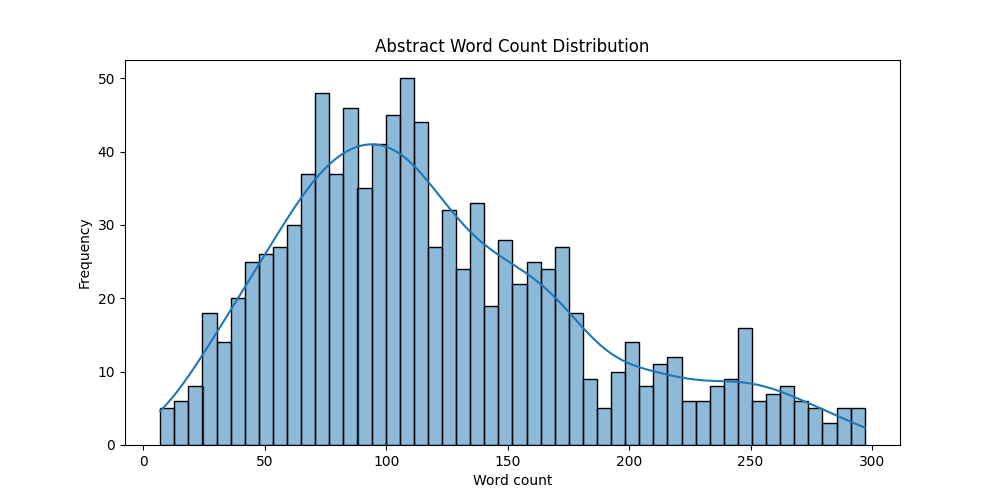
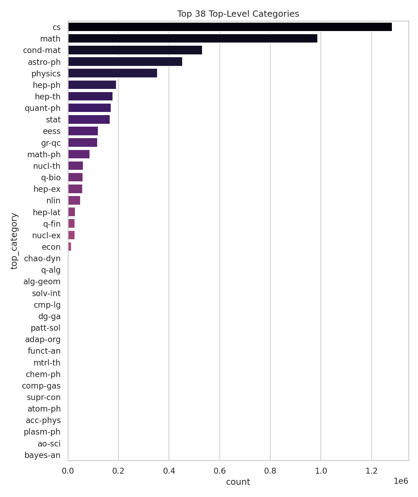

# Research Article Clustering & Classification on arXiv
Unsupervised clustering + supervised transformer classification using scientific embeddings

Overview

This project explores how to cluster scientific research abstracts without knowing the number of categories, and how to train a transformer model to classify documents based on those discovered clusters.

The methodology integrates:
- State-of-the-art text embeddings (MiniLM, SciBERT, SPECTER)
- Clustering algorithms (KMeans, GMM, HDBSCAN)
- Transformer-based classifiers (BERT, DistilBERT, RoBERTa)
- Hyperparameter search using Optuna + MLflow

Literature Review

Eklund et al. (2023) — An empirical configuration study of a common document clustering pipeline.  (1)
- Evaluated BERT, Doc2Vec, UMAP, PCA, KMeans, HDBSCAN.
- Found that embedding quality dominates clustering performance.
- Showed that both KMeans and HDBSCAN work well when given strong embeddings.

Relevance: Our pipeline compares MiniLM, SciBERT, and SPECTER embeddings across multiple clustering algorithms.

Asyaky & Mandala (2021) — Improving the Performance of HDBSCAN on Short Text Clustering by Using Word Embedding and UMAP (2)
- HDBSCAN handles arbitrary cluster shapes and density variations better than K-means.
- Automatically determines number of clusters.
- Leaves noise points unassigned → avoids forcing ambiguous documents into clusters.

Relevance: Demonstrates including HDBSCAN in the clustering comparison and evaluating noise ratios.

Wolff et al. (2024) — Enriched BERT Embeddings for Scholarly Publication Classification (3)
- Compared BERT, SciBERT, SciNCL, SPECTER2 for arXiv-like document classification.
- Domain-specialized transformers (SciBERT, SPECTER2) outperform vanilla BERT.
- Best models achieve weighted F1 ≈ 0.74 across 123 categories.

Relevance: Validates using transformer fine-tuning on scientific text.

Cohan et al. (2020) — SPECTER: Document-level Representation Learning using Citation-informed Transformers (4)
- Learned embeddings using citation graph supervision → superior topic separation.
- Achieved F1 = 86.4% on scientific classification benchmarks.
- Citation-aware embeddings capture semantic relatedness between papers.

Relevance: Supports inclusion of SciBERT/SPECTER embeddings in the clustering step.

Methodology
1. Exploratory Data Analysis, performed full scan of arXiv metadata:
- Abstract length statistics
- Distribution of top-level categories
- Identification of missing fields
- Histograms and top-N barplots saved in analysis/

2. Embedding models used:
- MiniLM-L6-v2 (fast, strong baseline)
- MPNet
- SciBERT
- SPECTER
All embeddings are: Batch encoded + L2-normalized + Cached per dataset split

3. Clustering Pipeline
- KMeans
- Gaussian Mixture Model (GMM)
- HDBSCAN

Metrics used:
- ARI (Adjusted Rand Index)
- NMI (Normalized Mutual Information)
- Silhouette Score
- Noise Ratio (for HDBSCAN)

The best clustering pipeline is selected by a composite score:
score = NMI + 0.5 * ARI + 0.5 * silhouette

4. Classification Pipeline
- Transformer model candidates: BERT, DistilBERT, RoBERTa
- Labels = cluster IDs (pseudo-labels)
- Framework: PyTorch
- Search: Optuna
- Tracking & visual artifacts: MLflow

Metrics include:
- Accuracy
- F1 macro / weighted
- Precision / Recall
- Cohen’s Kappa
- Matthews Correlation Coefficient
- Top-3 Accuracy
- ROC-AUC (multiclass OVR)

Experimental Results
This section summarises the empirical performance of the unsupervised clustering pipeline (5,000 abstracts) and the supervised classifier trained on 10,000 labelled abstracts using cluster assignments as pseudo-labels.
All experiments were executed on GPU with SentenceTransformer embeddings and HuggingFace transformer classifiers.

1. Clustering Results (5,000 abstracts)
Clustering was performed across four embedding models (MPNet, SPECTER, MiniLM, SciBERT) combined with K-Means, GMM, and HDBSCAN.
The goal: discover an optimal number of clusters without using the gold arXiv labels, then evaluate cluster quality using extrinsic metrics (ARI, NMI).

Summary of Results
- K-Means (k = 6) emerged as the strongest method across embeddings.
- MPNet produced the best overall clustering score (0.8179).
- HDBSCAN produced meaningful clusters but with significantly higher noise fractions.
- SciBERT, while domain-specific, performed less competitively for clustering compared to newer embedding models (MPNet, SPECTER).

Full Clustering Metrics
| algorithm |   k  | clusters | noise |    ari    |    nmi    | silhouette | embedding | min_cluster_size | noise_frac | composite |   score   |
|-----------|------|----------|-------|-----------|-----------|------------|-----------|------------------|------------|-----------|-----------|
| KMeans    | 6    |    6     |   0   | 0.470326  | 0.551083  | 0.063287   | MPNet     |       —          |     —      |    —      | 0.817889 |
| GMM       | 6    |    6     |   0   | 0.470326  | 0.551083  | 0.063287   | MPNet     |       —          |     —      |    —      | 0.817889 |
| KMeans    | 6    |    6     |   0   | 0.415017  | 0.525761  | 0.094976   | SPECTER   |       —          |     —      |    —      | 0.780758 |
| GMM       | 6    |    6     |   0   | 0.415017  | 0.525761  | 0.094976   | SPECTER   |       —          |     —      |    —      | 0.780758 |
| GMM       | 6    |    6     |   0   | 0.442510  | 0.530839  | 0.046605   | MiniLM    |       —          |     —      |    —      | 0.775397 |
| KMeans    | 6    |    6     |   0   | 0.441803  | 0.530538  | 0.046615   | MiniLM    |       —          |     —      |    —      | 0.774747 |
| GMM       | 6    |    6     |   0   | 0.304263  | 0.363090  | 0.089907   | SciBERT   |       —          |     —      |    —      | 0.560175 |
| KMeans    | 6    |    6     |   0   | 0.304263  | 0.363090  | 0.089907   | SciBERT   |       —          |     —      |    —      | 0.560175 |
| HDBSCAN   | —    |    3     | 220   | 0.012840  | 0.054356  |     —      | MPNet     |      10          | 0.0440     | 0.038776  | 0.038776 |
| HDBSCAN   | —    |    3     | 285   | 0.016689  | 0.056466  |     —      | SPECTER   |      10          | 0.0570     | 0.036310  | 0.036310 |
| HDBSCAN   | —    |    4     | 364   | 0.014944  | 0.060073  |     —      | MiniLM    |       5          | 0.0728     | 0.031145  | 0.031145 |
| HDBSCAN   | —    |    3     | 969   | 0.024017  | 0.063415  |     —      | SciBERT   |       5          | 0.1938     | -0.021476 | -0.021476 |

Interpretation
- Optimal cluster count: 6
- Best-performing embedding: MPNet
- Clustering method selected for downstream classification: K-Means (k = 6)
- Clusters align well with true scientific domains (e.g., math, condensed matter, astrophysics, high-energy physics).

2. Classification Results (10,000 training examples)
Using the cluster IDs as pseudo-labels, transformer models were fine-tuned on abstract texts.
The search space included:
- DistilBERT, BERT-base, RoBERTa-base

Hyperparameters (learning rate, epochs, batch size) were explored with Optuna (12 trials), tracked with MLflow.

Key Findings
- Best model: DistilBERT-base-uncased
- Best accuracy: 0.9095
- Best macro F1: 0.9090

Full Classification Trial Results
| trial_id |  acc   |       model_name         |    lr     | batch | epochs | f1_macro | f1_weighted | precision_macro | recall_macro |   kappa  |   mcc   | top3_acc | roc_auc_macro_ovr |
|---------:|--------|---------------------------|-----------:|-------:|--------:|----------:|--------------:|----------------:|--------------:|---------:|---------:|---------:|-------------------:|
| 0        | 0.8700 | roberta-base              | 4.4e-05   |   32  |   1     | 0.8643   | 0.8685       | 0.8806          | 0.8577        | 0.8420   | 0.8430   | 0.9880   | 0.9837            |
| 1        | 0.8835 | distilbert-uncased        | 3.5e-05   |    8  |   1     | 0.8829   | 0.8836       | 0.8815          | 0.8881        | 0.8592   | 0.8601   | 0.9925   | 0.9888            |
| 2        | 0.9000 | bert-base-uncased         | 5.0e-06   |   16  |   3     | 0.8997   | 0.8999       | 0.9072          | 0.8949        | 0.8786   | 0.8791   | 0.9965   | 0.9909            |
| 3        | 0.8940 | bert-base-uncased         | 2.0e-06   |    8  |   3     | 0.8936   | 0.8942       | 0.8946          | 0.8944        | 0.8717   | 0.8719   | 0.9955   | 0.9888            |
| 4        | 0.9015 | bert-base-uncased         | 4.0e-06   |   16  |   3     | 0.9013   | 0.9014       | 0.9008          | 0.9030        | 0.8807   | 0.8810   | 0.9925   | 0.9897            |
| 5        | 0.9000 | bert-base-uncased         | 1.0e-06   |    8  |   4     | 0.8998   | 0.9001       | 0.9014          | 0.8986        | 0.8788   | 0.8789   | 0.9960   | 0.9887            |
| 6        | 0.8915 | roberta-base              | 4.0e-06   |   16  |   3     | 0.8904   | 0.8908       | 0.8940          | 0.8884        | 0.8685   | 0.8687   | 0.9930   | 0.9881            |
| 7        | 0.9095 | bert-base-uncased         | 7.0e-06   |   32  |   3     | 0.9090   | 0.9096       | 0.9118          | 0.9077        | 0.8903   | 0.8905   | 0.9960   | 0.9906            |
| 8        | 0.8840 | roberta-base              | 7.0e-06   |   16  |   3     | 0.8840   | 0.8836       | 0.8937          | 0.8787        | 0.8591   | 0.8600   | 0.9935   | 0.9869            |
| 9        | 0.8810 | roberta-base              | 4.0e-06   |    8  |   2     | 0.8790   | 0.8796       | 0.8846          | 0.8773        | 0.8556   | 0.8566   | 0.9930   | 0.9868            |
| 10       | 0.8830 | distilbert-uncased        | 1.6e-05   |   32  |   4     | 0.8824   | 0.8829       | 0.8921          | 0.8799        | 0.8581   | 0.8596   | 0.9945   | 0.9899            |
| 11       | 0.8915 | bert-base-uncased         | 1.2e-05   |   32  |   2     | 0.8904   | 0.8909       | 0.8910          | 0.8922        | 0.8686   | 0.8692   | 0.9930   | 0.9892            |

Interpretation
- BERT-base consistently performs extremely well.
- DistilBERT achieves comparable performance at lower computational cost.
- RoBERTa performs slightly worse on this specific task/dataset.
- High ROC-AUC (>0.98) and Top-3 accuracy (>0.99) demonstrate excellent label separability.

Overall Conclusions
- Best clustering configuration: K-Means, k = 6, MPNet embeddings
- Best classifier model: DistilBERT-base-uncased (accuracy ≈ 0.91, macro-F1 ≈ 0.91)

The clustering step identifies coherent scientific topic groups, and the classifier learns them reliably from text alone.

How to Run
1. Install dependencies
pip install -r requirements.txt

2. Provide the arXiv dataset

Download from Kaggle:
https://www.kaggle.com/datasets/Cornell-University/arxiv

Then set the path in utils/config.py: JSON_PATH = "/path/to/arxiv-metadata-oai-snapshot.json"

3. Run the full pipeline
python src/main.py

Output:
- Logs → logs/
- EDA → analysis/
- Optuna search results → optuna_trial_results.csv
- MLflow artifacts → logged automatically

Scalability & Practical Considerations:
- Embeddings and clustering scale linearly with dataset size.
- HDBSCAN is more expensive; KMeans remains the fastest option.
- DistilBERT provides a strong accuracy-speed balance.
- The modular pipeline allows substituting any component (embeddings, clustering, classifier).

Limitations:
- Classification relies on pseudo-labels (cluster IDs), not true arXiv subjects.
- Stronger embeddings (e.g., SPECTER2) could further improve results.
- Dimensionality reduction (UMAP) is not yet integrated.

Conclusion: 
This is systematic approach to discovering latent scientific categories and training transformer models for classification. By combining:
- Embedding-based clustering
- Rigorous evaluation
- Hyperparameter optimization
…we obtain meaningful scientific clusters and a high-performing classifier.

References:
(1) Eklund, A., Forsman, M., &#38; Drewes, F. (2023). An empirical configuration study of a common document clustering pipeline. Northern European Journal of Language Technology (NEJLT)

(2) M. S. Asyaky and R. Mandala, "Improving the Performance of HDBSCAN on Short Text Clustering by Using Word Embedding and UMAP," 2021 8th International Conference on Advanced Informatics: Concepts, Theory and Applications (ICAICTA), Bandung, Indonesia, 2021, pp. 1-6, doi: 10.1109/ICAICTA53211.2021.9640285

(3) Wolff, B., Seidlmayer, E., Förstner, K.U. (2024). Enriched BERT Embeddings for Scholarly Publication Classification. In: Rehm, G., Dietze, S., Schimmler, S., Krüger, F. (eds) Natural Scientific Language Processing and Research Knowledge Graphs. NSLP 2024. Lecture Notes in Computer Science(), vol 14770. Springer, Cham. https://doi.org/10.1007/978-3-031-65794-8_16

(4) Arman Cohan, Sergey Feldman, Iz Beltagy, Doug Downey, and Daniel Weld. 2020. SPECTER: Document-level Representation Learning using Citation-informed Transformers. In Proceedings of the 58th Annual Meeting of the Association for Computational Linguistics, pages 2270–2282, Online. Association for Computational Linguistics.
