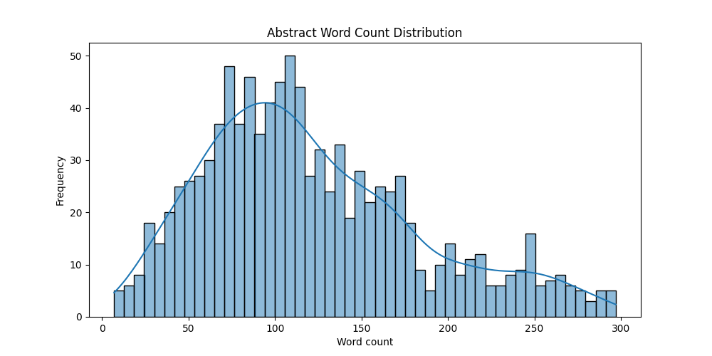
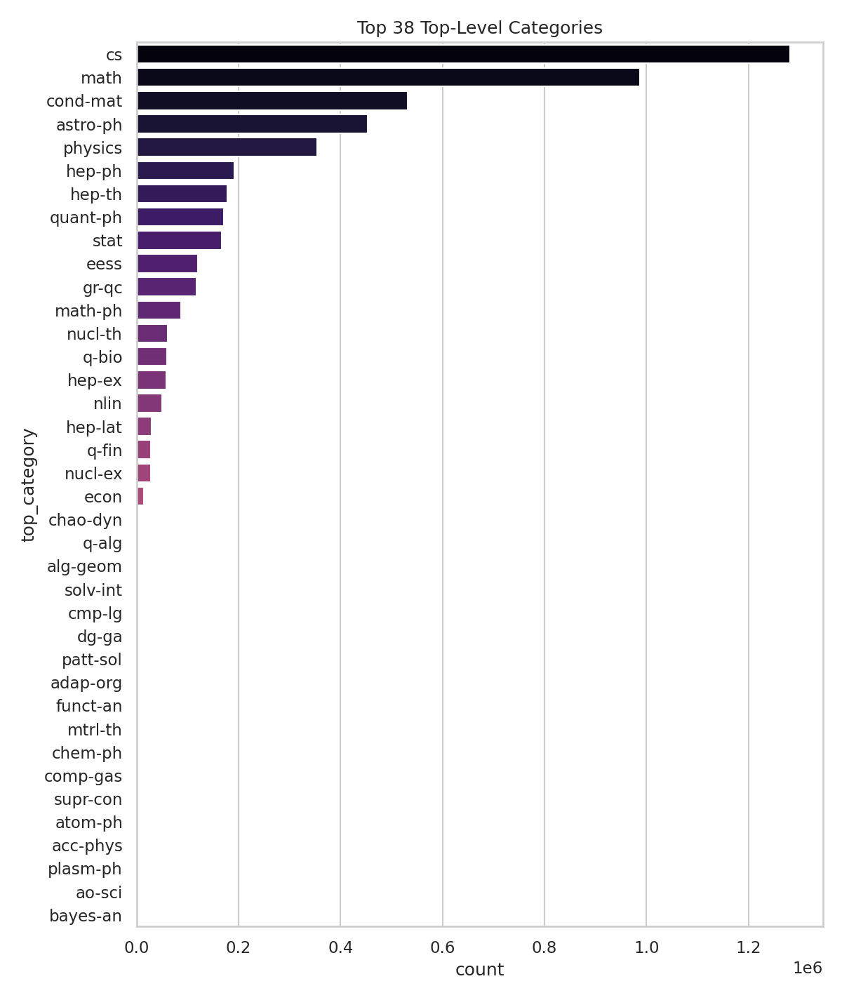

# Research Article Clustering & Classification on arXiv

Unsupervised clustering + supervised transformer classification using scientific embeddings  
*Based on*: [Arcan (2025)](https://arxiv.org/abs/2601.08841)

---

## Overview

This project explores how to cluster scientific research abstracts without prior knowledge of category structure, and how to train a transformer model to classify documents based on discovered clusters.

The methodology integrates:

- State-of-the-art text embeddings (MiniLM, SciBERT, SPECTER)
- Clustering algorithms (KMeans, GMM, HDBSCAN)
- Transformer-based classifiers (BERT, DistilBERT, RoBERTa)
- Hyperparameter optimization using Optuna + experiment tracking via MLflow

## Installation

Use the minimal runtime dependencies:

```bash
pip install -r requirements.txt
python -m spacy download en_core_web_sm
```

## Reproducible Run

Default config:

```bash
python src/main.py --config config/default.yaml
```

Override key settings from CLI:

```bash
python src/main.py abstract hybrid \
  --config config/default.yaml \
  --cluster-selection-mode unsupervised \
  --seed 42
```

Notes:

- Optuna now optimizes `f1_macro` (not accuracy).
- Tuning uses train/val only; final metrics are reported on untouched holdout test split.
- Global seeding and deterministic mode are enabled via config.







---

## Results

Empirical evaluation of unsupervised clustering (5,000 abstracts) and transformer-based classification (10,000 labeled abstracts using pseudo-labels). 

See [Arcan (2025)](https://arxiv.org/abs/2601.08841) for full methodology and benchmarks.

---

## Conclusion

This pipeline implements an approach to demonstrate that combining structured triples with unstructured scientific text improves both clustering coherence and classification accuracy. It provides a strong foundation for knowledge-aware semantic organization of research documents.

---

## BibTeX

```bibtex
@misc{arcan2025triplesknowledgeinfusedembeddingsclustering,
  title={Triples and Knowledge-Infused Embeddings for Clustering and Classification of Scientific Documents}, 
  author={Mihael Arcan},
  year={2025},
  eprint={2601.08841},
  archivePrefix={arXiv},
  primaryClass={cs.CL},
  url={https://arxiv.org/abs/2601.08841}
}
```
